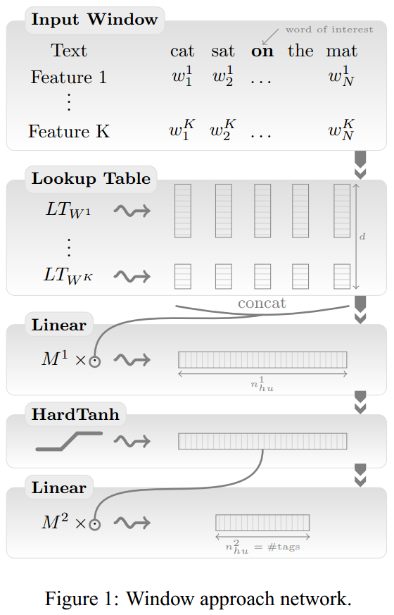
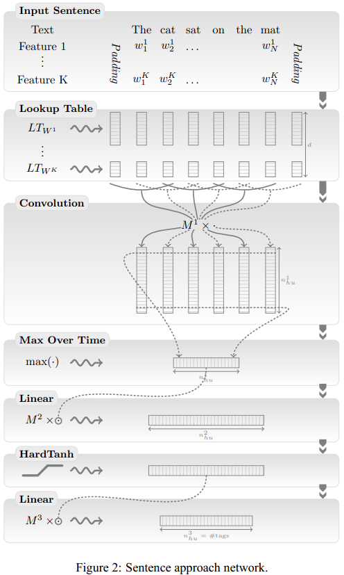

# 基于神经网络的词性标注模型

传统的词性标注需要从句子中抽取一系列精心设计的特征。Bengio将词向量引入自然语言处理中，大大减少了特征工程的工作量。

首先介绍一个简单的基于神经网络模型的词性标注器。模型从左向右依次标注句子中的单词，对于当前单词，抽取周围一定窗口大小内的特征，然后将其作为特征向量送入前馈神经网络分类器。这个分类器会预测出当前单词在上下文中最可能的词性。

如下图所示，整个神经网络分为多层。第一层把每个单词映射到一个特征向量，得到单词级别的特征；第二层利用滑动窗口得到单词上下文的特征向量，不像传统的词袋方法，这个方法保留了窗口内单词的顺序关系。同时也可以加入其他特征，如单词是否首字母大写、单词的词干等。单词上下文的特征向量被送入后续的隐层，最终到达输出层。对于每个单词，输出层会有 $$n$$ 个输出，其中 $$n$$ 是词性标签集合的大小。每个输出值都可以看作该词性标签的得分，其中最大的输出值对应的标签就是当前单词最可能的词性。

在计算上下文特征时只考虑当前单词附近窗口大小为 $$k$$ 范围内的单词，这种方法叫作窗口方法（Window Approach）。将整个句子的单词特征向量送入后续网络中，这种方法叫作句子方法（Sentence Approach）。对于词性标注来说，句子方法并不能带来明显的效果提升，但是对于自然语言处理的某些任务，如语义角色标注（SRL），句子方法带来的效果提升会比较明显。此外，因为句子长度一般是不定的，所以在使用句子方法的神经网络模型中会增加卷积层。

一般来说，神经网络模型的优化目标是最大化对数似然函数。公式右侧的 $$\sum\limits_{(x,y)\in T}\log p(y|x,\theta)$$ 是模型的对数似然函数，模型的优化目标就是最大化这个函数，得到参数估计 $$\theta$$ 。其中 $$T$$ 是训练数据集， $$x$$ 是输入的特征向量， $$y$$ 是对应的标注， $$\theta$$ 是模型的参数， $$p(.)$$ 是神经网络输出层的输出结果。

                                                             $$\theta \mapsto \sum\limits_{(x,y)\in T}\log p(y|x,\theta)$$ 

单词级别的最大似然是通过每个单词分别计算得到的。给定一个输入特征向量 $$x$$ ，设模型的参数为 $$\theta$$ ，输入 $$x$$ 的标注的索引为 $$y$$ 。 $$f_\theta^j(x)$$ 表示的是模型在给定 $$x$$ 和 $$\theta$$ 的情况下，第 $$j$$ 个词性得到的分数。根据Softmax操作，对于一条训练数据 $$(x,y)$$ 来说，对数似然函数如下：

                                      $$\log p(y|x,\theta)=\log \frac{e^{f_\theta^y(x)}}{\sum_je^{f_\theta^j(x)}}=f_\theta^y(x)-\log(\sum_je^{f_\theta^j(x)})$$ 

对于自然语言里的某些任务，如语义角色标注（SRL），需要用到句子级别的对数似然函数。不过，对词性标注效果提升不大。

上面使用的是有监督的训练方法。此外，还可以借助大量的无标注数据来训练语言模型，从而得到更好的单词特征向量表示。用无监督训练得到词向量初始化词性标注模型的词向量，能明显提升词性标注的准确率。值得一提的是，越大的语料训练出的模型越好。不过，这个训练过程比较缓慢，可以通过一点点地增加语料迭代优化。

## Source



