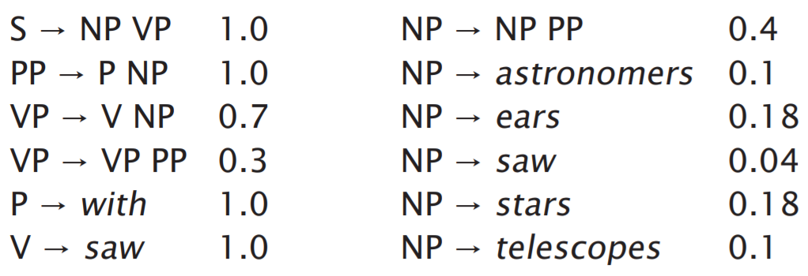
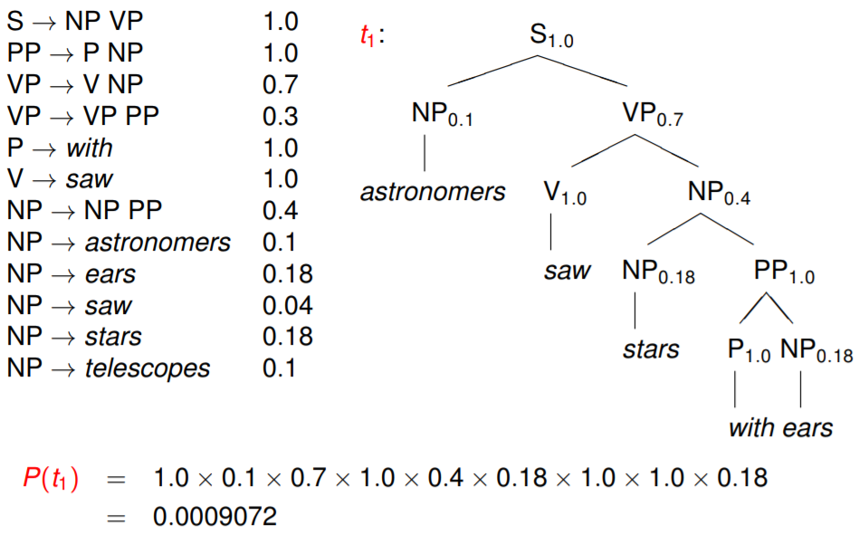

# 基于PCFG的句法分析

PCFG（Probabilistic Context Free Grammar）是基于概率的短语结构分析方法，是目前研究最为充分、形式最为简单的统计句法分析模型，也可以认为是规则方法与统计方法的结合。

PCFG是上下文无关文法的扩展，是一种生成式的方法，其短语结构文法可以表示为一个五元组（ $$X,V,S,R,P$$ ）：

* $$X$$ 是一个有限词汇的集合（词典），它的元素称为词汇或终结符。
* $$V$$ 是一个有限标注的集合，称为非终结符集合。
* $$S$$ 称为文法的开始符合，其包含于 $$V$$ ，即 $$S\in V$$ 。
* $$R$$ 是有序偶对（ $$\alpha,\beta$$ ）的集合，也就是产生的规则集。
* $$P$$ 代表每个产生规则的统计概率。

PCFG可以解决以下问题：

* 基于PCFG可以计算分析树的概率值。
* 若一个句子有多个分析树，可以依据概率值对所有的分析树进行排序。
* PCFG可以用来进行句法排歧，面对多个分析结果选择概率值最大的。

## 例子

下面根据一个例子来看PCFG求解最优句法树的过程。有一个规则集，内容如下：

其中第一列表示规则，第二列表示该规则成立的概率。

给定句子 $$S$$ ：astronomers saw stars with ears，得到两个句法树，如下图所示：

因为 $$P(t_1)>P(t_2)$$ ，因此选择 $$t_1$$ 作为最终的句法树。

根据上述例子，我们很自然想到关于PCFG的三个基本问题。

* 给定上下文无关文法 $$G$$ ，如何计算句子 $$S$$ 的概率，即计算 $$P(S|G)$$ ？
* 给定上下文无关文法 $$G$$ 以及句子 $$S$$ ，如何选择最佳的句法树，即计算 $$\mathop{\arg \max}\limits_TP(T/S,G)$$ ？
* 如何为文法规则选择参数，使得训练句子的概率最大，即计算 $$\mathop{\arg \max}\limits_GP(S,G)$$ ？

可以使用[内向和外向算法](https://godweiyang.com/2018/04/19/inside-outside/)解决第一个问题，可以使用Viterbi算法解决第二个问题，使用EM算法解决第三个问题。

作为目前最成功的基于语法驱动的统计句法分析方法，PCFG衍生出了各种形式的算法，包括基于单纯PCFG的句法分析方法、基于词汇化的PCFG的句法分析方法、基于子类划分PCFG的句法分析方法等。这些方法各有千秋，使用时可根据具体效果进行甄选。

## Source







