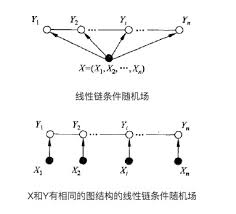

# 命名实体识别

命名实体识别的目的是识别语料库中的人名、地名、组织机构名等命名实体。命名实体识别\(Named Entity Recognition\)研究的命名实体一般分为3大类（实体类、时间类、数字类）和7小类（人名、地名、组织机构名、时间、日期、货币和百分比）。由于数量、时间、日期、货币等实体识别通常可以采用模式匹配的方式获得较好识别，相比之下人名、地名、机构名较复杂，因此近年来的研究主要以这几种实体为主。

### 基于条件随机场的命名实体识别

条件随机场是在给定观察的标记序列下，计算整个标记序列的联合概率，其定义为：

设 $$X=(X_1,X_2,X_3,\cdots X_n)$$ 和 $$Y=(Y_1,Y_2,Y_3,\cdots Y_m)$$ 是联合随机变量，若随机变量 $$Y$$ 构成一个无向图 $$G=(V,E)$$ 表示的马尔可夫模型，则其条件概率分布 $$P(Y|X)$$ 称为条件随机场\(Conditional Random Field, CRF\)，即：

                                     $$P(Y_v|X,Y_w,w\neq v) = P(Y_v|X,Y_w,w\sim v)$$

其中 $$w\sim v$$ 表示图 $$G=(V,E)$$ 中与节点 $$v$$ 有边连接的所有节点， $$w \neq v$$ 表示节点 $$v$$ 以外所有节点

#### 示例说明

现有个由 $$n$$ 个字符构成的NER的句子，每个字符的标签都在我们已知的标签集合\(B、M、E、S和O\)中选择\(如下表\)，当我们为每个字符选定标签后，就形成了一个随机场。

| 标注 | 含义 |
| :---: | :---: |
| B | 当前词为地理命名实体的首部 |
| M | 当前词为地理命名实体的内部 |
| E | 当前词为地理命名实体的尾部 |
| S | 当前词独立构成地理命名实体 |
| O | 当前词为不是地理命名实体或组成部分 |

如果在其中加 一些约束，如所有字符的标签只与相邻的字符的标签有关，那么久转化成马尔可夫随机场问题。从马尔可夫随机场到条件随机场就好理解很多，其假设马尔可夫随机场中有 $$X$$ 和 $$Y$$ 两种变量， $$X$$ 一般是给定的， $$Y$$ 是在给定 $$X$$ 条件下的输出。在前面的例子中， $$X$$ 是字符， $$Y$$ 是标签， $$P(X|Y)$$ 就是条件随机场。在条件随机场的定义中，我们并没有要求变量 $$X$$ 与 $$Y$$ 具有相同的结构。实际在自然语言处理中，多假设其结构相同，即 $$m=n$$ :

                            $$X=(X_1,X_2,X_3,\cdots X_n),\ Y=(Y_1,Y_2,Y_3,\cdots Y_n)$$ 

一般将这种结构称为线性链条件随机场。定义如下：

设 $$X=(X_1,X_2,X_3,\cdots X_n)$$ 和 $$Y=(Y_1,Y_2,Y_3,\cdots Y_n)$$ 均为线性链表示的随机变量序列，若在给定的随机变量序列 $$X$$ 的条件下，随机变量序列 $$Y$$ 的条件概率分布 $$P(Y|X)$$ 构成条件随机场，且满足马尔可夫性：

                                    $$P(Y_i|X,Y_1,Y_2,\cdots ,Y_n)=P(Y_i|X,Y_{i-1},Y_{i+1})$$ 

则称 $$P(Y|X)$$ 为线性链的条件随机场。线性链CRF不仅考虑上一状态 $$Y_{i-1}$$ 还考虑后续的状态结果 $$Y_{i+1}$$因此，HMM是一个有向图（HMM处理时，每个状态依赖上一个状态），而线性链CRF是一个无向图（每个状态依赖于当前状态的周围节点状态）。 

对句子“我来到牛家村”进行标注，正确标注后的结果应为“我/O 来/O 到/O 牛/B 家/M 村/E”。\(O,O,O,B,M,E\)是一种标注序列，还有\(O,O,O,B,B,E\)...等各种标记方法，NER的任务就是在如此多的可选标注序列中，找出最靠谱的作为句子的标注。在CRF中，定义一个特征函数集合，然后使用这个特征集合为标注序列打分，据此选出最靠谱的标注序列。该序列的分值是通过综合考虑特征集合中的函数得出的。

在CRF中有两种特征函数，分别为转移函数 $$t_k(y_{i-1},y_i,i)$$ 和状态函数 $$s_l(y_i,X,i)$$：

$$t_k(y_{i-1},y_i,i)$$ 依赖于当前和前一个位置，表示从标注序列中位置 $$i-1$$ 的标记 $$y_{i-1}$$ 转移到位置 $$i$$ 上的标记 $$y_i$$ 的概率。 $$s_l(y_i,X,i)$$依赖当前位置，表示标记序列在位置 $$i$$ 上为标记 $$y_i$$ 的概率。通常特征函数取值为 $$1$$ 或 $$0$$，表示符不符合该条件约束。完整的线性链CRF的参数形式如下：

                      $$P(y|x) = \frac{1}{Z(x)}exp(\sum_{i,k}\lambda_kt_k(y_{i-1},y_i,i)+\sum_{i,l}\mu_ls_l(y_i,X,i))$$ 

其中：$$Z(x)=\sum_y exp(\sum_{i,k}\lambda_kt_k(y_{i-1},y_i,i)+\sum_{i,l}\mu_ls_l(y_i,X,i))$$ 

$$Z(x)$$ 是规范化因子，其求和操作是在所有可能的输出序列上做的； $$\lambda_k$$ 和 $$\mu_l$$ 为转移函数和状态函数对应的权值。通常为了计算方便，简化为下式：

                                     $$P(y|x) = \frac{1}{Z(x)} exp(\sum_j\sum_iw_jf_j(y_{i-1},y_i,x,i))$$ 

对应的 $$Z(x)$$ 为： $$Z(x)=\sum_y exp(\sum_j\sum_iw_jf_j(y_{i-1},y_i,x,i))$$ 

其中， $$f_j(y_{i-1},y_i,x,i)$$ 为两特征函数 $$t_k(y_{i-1},y_i,i)$$ 和 $$s_l(y_i,X,i)$$ 的统一符号。

使用CRF来做命名实体识别时，目标是求 $$arg\ \mathop{max}\limits_y P(y|x)$$ ，该问题和HMM求解最大可能序列路径一样，用维特比\(Veterbi\)算法即可。

