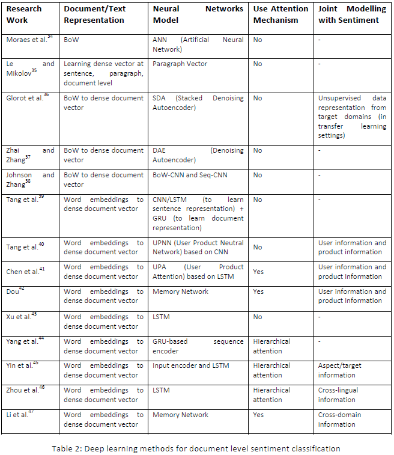

# 文档维度情感分析

文档级别的情感分类是将文档确定其整体情绪方向/极性，即确定文档（例如，完整的在线评论）是否传达整体正面或负面意见。在此设置中，它是二分类任务（正面/负面）。它也可以被表述为回归任务，例如，推断用于评价的1到5星的总体评分（1分负面一直至5分正面）。一些研究人员还将此视为5分类任务。

情感分类通常被视为文档分类的特例。在这种分类中，文档表示起着重要作用，所以文档表示应该反映文档中单词或句子传达的原始信息。传统上，词袋模型（BoW）用于在NLP和文本挖掘中生成文本表示。基于BoW，文档被转换为具有固定长度的数字特征向量，其每个元素可以是单词出现与否（缺席或存在, 0/1），单词频率或TF-IDF分数。这个向量的维度等于词汇量的大小。来自BoW的文档向量通常非常稀疏，因为单个文档仅包含词汇表中的少量单词。早期神经网络采用了这种特征设置。

尽管上述方法很受欢迎，但BoW有一些缺点。首先，忽略单词顺序，这意味着只要它们共享相同的单词，两个文档就可以具有完全相同的表示。 Bag-of-N-Grams是BoW的扩展，可以在短语境（n-gram）中考虑单词顺序，但它也会受到数据稀疏性和高维度的影响。其次，BoW几乎不能编码单词的语义。例如，“smart”，“clever”和“book”等词在BoW中它们之间的距离相等，但“smart”应该在语义上更接近“clever”而不是“book”。

为了解决BoW的缺点，提出了基于神经网络的文字嵌入技术（CBOW、Skip-Gram、word2vec等）来生成用于单词表示的密集向量（或低维向量），这在某种程度上能够编码一些单词的属性（语义和句法等）。利用单词嵌入作为单词的输入，可以使用神经网络导出作为密集向量（或称为密集文档向量）的文档表示。

注意，除了上述两种方法，即使用BoW和通过字嵌入学习文档的密集向量之外，还可以直接从BoW学习密集文档向量。我们区分下图中展示相关研究中使用的不同方法。

当文档被恰当地表示时，可以遵循传统的监督学习设置使用各种神经网络模型来进行情感分类。在一些情况下，神经网络可以仅用于提取文本特征/文本表示，并且这些特征被馈送到一些其他非神经分类器（例如，SVM）以获得最终的全局最佳分类器。神经网络和SVM的特性以它们的优点相结合的方式相互补充。

除了复杂的文档/文本表示外，研究人员还利用数据的特征 - 产品评论，进行情感分类。对于产品评论，一些研究人员发现共同模拟情绪和一些额外信息（例如，用户信息和产品信息）进行分类是有益的。另外，由于文档通常包含长依赖关系，因此注意机制也经常用于文档级情感分类。我们总结了上面的图表2中的现有技术。

## 各技术简介

#### [Document-level sentiment classification: An empirical comparison between SVM and ANN](https://www.sciencedirect.com/science/article/pii/S0957417412009153)

Moraes等人对支持向量机（SVM）和人工神经网络（ANN）进行了文档级情感分类的实证比较，证明了ANN在大多数情况下和SVM结果可以媲美。

#### [Distributed Representations of Sentences and Documents](https://arxiv.org/abs/1405.4053)

为了克服BoW的弱点，Le和Mikolov提出了Paragraph Vector，这是一种无监督学习算法，可以学习句子、段落和文档等可变长度文本的矢量表示。通过预测从段落中采样的上下文中的周围单词来学习矢量表示。

#### [Domain adaptation for large-scale sentiment classification a deep learning approach](http://www.icml-2011.org/papers/342_icmlpaper.pdf)

Glorot等人研究了情绪分类的领域适应问题。他们提出了一种基于具有稀疏整流器单元的Stacked Deoising Autoencoder的深度学习系统，该系统可以使用标记和未标记的数据执行无监督的文本特征/表示提取。这些特征非常有利于情感分类器的域适应。

#### [Semi-supervised autoencoder for sentiment analysis](https://www.aaai.org/ocs/index.php/AAAI/AAAI16/paper/download/12059/11750)

Zhai和Zhang介绍了一种半监督自动编码器，它进一步考虑了学习阶段的情绪信息，以获得更好的文档向量，用于情感分类。更具体地，该模型通过将自动编码器中的损失函数放宽到[Bregman divergence](https://en.wikipedia.org/wiki/Bregman_divergence)并且还从标签信息导出判别性损失函数来学习文本数据的任务特定表示。

#### [Effective Use of Word Order for Text Categorization with Convolutional Neural Networks](https://arxiv.org/abs/1412.1058)

Johnson和Zhang提出了一个名为BoW-CNN的CNN变体，它在卷积层中采用了词袋转换。他们还设计了一个名为Seq-CNN的新模型，它通过连接多个单词的oneHot矢量来保持单词的顺序信息。

#### [Document modelling with gated recurrent neural network for sentiment classification](http://aclweb.org/anthology/D15-1167)

Tang等人提出了一种神经网络来学习文档表示，并考虑句子关系。它首先从单词嵌入中学习CNN或LSTM的句子表示。然后利用GRU自适应地编码句子的语义及其在情感分类的文档表示中的固有关系。

#### [Learning Semantic Representations of Users and Products for Document Level Sentiment Classification](http://ir.hit.edu.cn/~dytang/paper/acl2015/acl2015.pdf)

Tang等人在评论分类中应用了用户表示和产品表示。这个想法是这些表示可以捕获重要的全球线索，例如用户的个人偏好和产品的整体质量，这可以提供更好的文本表示。

#### [Neural Sentiment Classification with User and Product Attention](https://aclweb.org/anthology/D16-1171)

Chen还整合了用户信息和产品信息以进行分类，但通过单词和句子级别的注意，可以考虑单词级别和语义级别的全局用户偏好和产品特征。同样，[Dou](http://aclweb.org/anthology/D17-1054)使用深存储网络来捕获用户和产品信息。所提出的模型可以分为两个独立的部分。在第一部分中，LSTM用于学习文档表示。在第二部分中，由多个计算层（跳）组成的深存储器网络用于预测每个文档的评论评级。

#### [Cached Long Short-Term Memory Neural Networks for Document-Level Sentiment Classification](https://arxiv.org/abs/1610.04989)

Xu等人提出了一个缓存的LSTM模型来捕获长文本中的整体语义信息。模型中的内存分为几组，具有不同的遗忘率。直觉是使具有低遗忘率的存储器组捕获全局语义特征和具有高遗忘率的存储器组以学习本地语义特征。

#### [Hierarchical attention networks for document classification](https://www.cs.cmu.edu/~hovy/papers/16HLT-hierarchical-attention-networks.pdf)

Yang等人提出了一种用于评论文档级别情绪评级预测的分层关注网络。该模型包括两个级别的注意机制：一个在单词级别，另一个在句子级别，这允许模型在构造文档表示时或多或少地关注单个单词或句子。

#### [Document-Level Multi-Aspect Sentiment Classification as Machine Comprehension](http://www.cse.ust.hk/~yqsong/papers/2017-EMNLP-AspectClassification.pdf)

Yin等人将文档级方面情绪评级预测任务制定为机器理解问题，并提出了一种分层交互式关注模型。具体而言，文档和伪方面问题是交错的，以学习方面感知文档表示。

#### [Attention-based LSTM Network for Cross-Lingual Sentiment Classification](https://aclweb.org/anthology/D16-1024)

Zhou等人在文档层面设计了一个基于注意力的LSTM网络，用于跨语言情感分类。该模型由两个基于注意的LSTM组成，用于双语表示，每个LSTM也是分层结构的。在此设置中，它有效地将情绪信息从资源丰富的语言（英语）调整为资源贫乏的语言（中文），并有助于提高情绪分类性能。

#### [End-to-End Adversarial Memory Network for Cross-domain Sentiment Classification](https://www.ijcai.org/proceedings/2017/0311.pdf)

Li等人在转移学习设置中提出了用于跨域情感分类的对抗性内存网络，其中来自源域和目标域的数据被一起建模。它联合训练两个网络用于情感分类和域分类（即，文档是来自源域还是目标域）。

## Source



