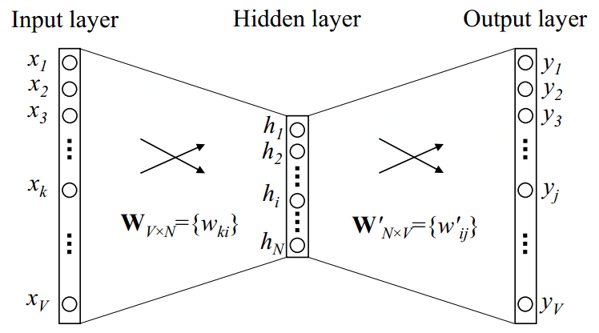

# 文本向量化

文本向量化就是将文本表示成一系列能够表达文本语义的向量。

## Continuous Bag-of-Word Model

Continuous Bag-of-Word\(CBOW\)顾名思义，即连续词袋模型，即文本以单个词为最小单位，像“support vector machine”词组也会被当做三个独立的词考虑，且是连续词袋，即目标词的前后词也作为因素考虑。

### One-word context

#### 模型结构

下图为网络模型例子，词汇表大小为 $$V$$；隐藏层宽度为 $$N$$，各层连接为全连接方式；输入为one-hot编码的向量，即词汇表出现的 $$V$$ 个非重复词，一个词 $$w$$ 的向量 $$(x_1,x_2,\dots,x_V)$$ 为对应 $$x_w$$ 的位置为 $$1$$ ，其他位置都为 $$0$$ ；真实的 $$y$$ 为文本中输入词的下一个词的one-hot编码的向量。

输入层和隐藏层间的权重可由一个 $$V\times N$$ 的矩阵 $$W$$ 表示。 $$W$$ 的每一行是一个 $$N$$ 维向量，表示输入层对应的词向量 $$v_w$$ 。设 $$W$$ 的第 $$i$$ 行是 $$v_w^T$$ ，给定一个词 $$x_k=1$$ 且 $$x_{k'}=0$$ 对于 $$k'\neq k$$ （即这个词的one-hot向量只有 $$k$$ 位置为 $$1$$ ），我们可得：

                                                           $$h=W^Tx=W^T_{(k,\cdot)}:=v^T_{w_I}$$ 

即将 $$W$$ 的第 $$k$$ 行复制给了 $$h$$ （因为输入是one-hot，经过矩阵相乘其实就是把权重 $$W$$ 对应行的值传递给下一层）。 $$v_{w_I}$$ 即是输入词 $$w_I$$ 的向量表示。（这就意味着隐藏层的激活函数是线性的即可，不需要使用ReLU之类的对它们进行非线性变换。比如Multi-word context model中直接把这层的输入进行加权求和传给下层）

隐藏层到输出层的权重可用一个 $$N\times V$$ 的矩阵 $$W'=\{w'_{ij}\}$$ 表示。基于权重，我们对于每一个词汇表里的词可计算一个分数 $$u_j$$：

                                                                         $$u_j=v_{w_j}'^T h$$ 

其中 $$v'_{w_j}$$ 是 $$W'$$ 第 $$j$$ 列。然后我们用softmax去获得这个词的后验分布，是一个多项式分布：

                                                        $$p(w_j|w_I)=y_j=\frac{\exp(u_j)}{\sum\limits_{j'=1}^V\exp (u_{j'})}$$ 

其中 $$y_j$$ 是输出层第 $$j$$ 个单元的输出。结合输入层到隐藏层 $$h=W^Tx=W^T_{(k,\cdot)}:=v^T_{w_I}$$ 和隐藏层到输出层 $$u_j=v_{w_j}'^T h$$ 公式代入softmax，我们得到：

                                                          $$p(w_j|w_I)=\frac{\exp(v_{w_j}'^T)v_{w_I}}{\sum\limits_{j'=1}^V\exp(v_{w_{j'}'}'^Tv_{w_I})}$$ 

这里 $$v_w$$ 和 $$v_w'$$ 是词 $$w$$ 的两种表达形式。 $$v_w$$ 源自输入层到隐藏层权重矩阵 $$W$$ 的行， $$v_w'$$ 源自隐藏层到输出层权重矩阵 $$W'$$ 的列。

#### 模型训练

模型目标是最大化 $$p(w_j|w_I)=\frac{\exp(v_{w_j}'^T)v_{w_I}}{\sum\limits_{j'=1}^V\exp(v_{w_{j'}'}'^Tv_{w_I})}$$ ，即模型输入 $$w_I$$，模型输出$$w_O$$\(表示它的index在输出层为$$j^*$$\) 与真实$$y$$\(输入词的下一个词的one-hot向量\)一致。即 $$y$$ 向量第 $$k$$ 位为 $$1$$，其他为 $$0$$ ，我们期望的最佳模型是输出层第 $$k$$ 个单元为 $$1$$ ，其他为 $$0$$ 。模型训练使用反向传播，首先我们先计算代价函数：

                $$\max p(w_O|w_I)=\max y_{j^*}=\max \log y_{j^*} = u_{j^*}-\log \sum\limits_{j'=1}^V\exp(u_{j'}):=-E$$ 

其中 $$E = -\log p(w_O|w_I)$$ 是我们的损失函数（我们想要最小化 $$E$$ ）。

更新隐藏层到输出层权重：

## Source



