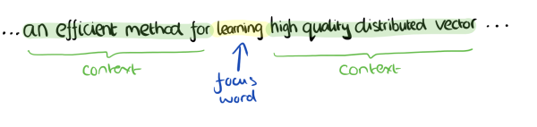
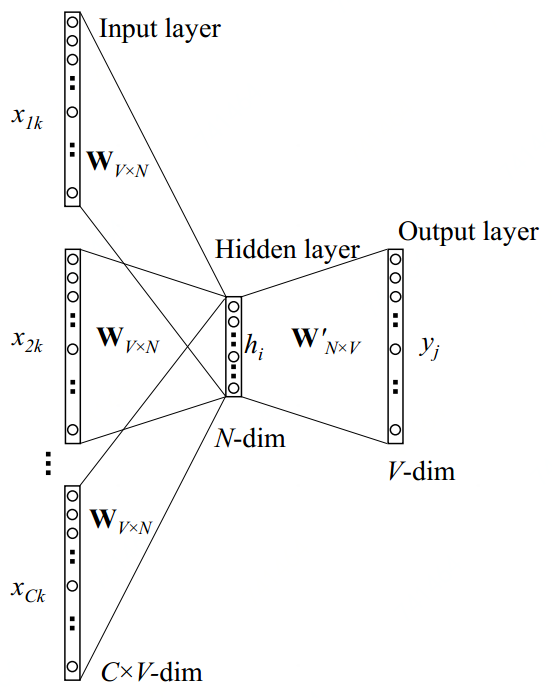

# Continuous Bag-of-Word

Continuous Bag-of-Word\(CBOW\)顾名思义，即连续词袋模型，即文本以单个词为最小单位，像“support vector machine”词组也会被当做三个独立的词考虑，且是连续词袋，即目标词的前后词也作为因素考虑。

## One-word context

### 模型结构

下图为网络模型例子，词汇表大小为 $$V$$；隐藏层宽度为 $$N$$\(即我们想要的词向量维度\)，各层连接为全连接方式；输入为one-hot编码的向量，即词汇表出现的 $$V$$ 个非重复词，一个词 $$w$$ 的向量 $$(x_1,x_2,\dots,x_V)$$ 为对应 $$x_w$$ 的位置为 $$1$$ ，其他位置都为 $$0$$ ；真实的 $$y$$ 为文本中输入词的下一个词的one-hot编码的向量。

输入层和隐藏层间的权重可由一个 $$V\times N$$ 的矩阵 $$W$$ 表示。 $$W$$ 的每一行是一个 $$N$$ 维向量，表示输入层对应的词向量 $$v_w$$ 。

                                                       $$W =  \left[  \begin{matrix}    w_{11} \ \  w_{12} \ \ \dots\ \ w_{1N}\\  w_{21} \ \  w_{22} \ \ \dots\ \ w_{2N}\\  \dots \ \  \dots \ \ \dots\ \ \dots\\  w_{V1} \ \  w_{V2} \ \ \dots\ \ w_{VN}\\  \end{matrix}   \right] $$ 

$$W$$ 的第 $$i$$ 行是 $$v_w^T$$ ，给定一个词 $$x_k=1$$ 且 $$x_{k'}=0$$ 对于 $$k'\neq k$$ （即这个词的one-hot向量只有 $$k$$ 位置为 $$1$$ ），我们可得：

                                                           $$h=W^Tx=W^T_{(k,\cdot)}:=v^T_{w_I}$$                                                                 （1）

其实就是将 $$W$$ 的第 $$k$$ 行复制给了 $$h$$ ，因为 $$x$$ 只有在第 $$k$$ 位置是 $$1$$ （因为输入是one-hot，经过矩阵相乘其实就是把权重 $$W$$ 对应行的值传递给下一层）。 $$v_{w_I}$$ 即是输入词 $$w_I$$ 的向量表示。（这就意味着隐藏层的激活函数是线性的即可，不需要使用ReLU之类的对它们进行非线性变换。比如Multi-word context model中直接把这层的输入进行加权求和传给下层）

隐藏层到输出层的权重可用一个 $$N\times V$$ 的矩阵 $$W'=\{w'_{ij}\}$$ 表示：

                                                     $$W' =  \left[  \begin{matrix}    w'_{11} \ \  w'_{12} \ \ \dots\ \ w'_{1N}\\  w'_{21} \ \  w'_{22} \ \ \dots\ \ w'_{2N}\\  \dots \ \  \dots \ \ \dots\ \ \dots\\  w'_{V1} \ \  w'_{V2} \ \ \dots\ \ w'_{VN}\\  \end{matrix}   \right] $$ 

基于权重，我们对于每一个词汇表里的词可计算一个分数 $$u_j$$：

                                                                          $$u_j=v_{w_j}'^T h$$                                                                                  （2）

其中 $$v'_{w_j}$$ 是 $$W'$$ 第 $$j$$ 列。然后我们用softmax去获得这个词的后验分布，是一个多项式分布：

                                                        $$p(w_j|w_I)=y_j=\frac{\exp(u_j)}{\sum\limits_{j'=1}^V\exp (u_{j'})}$$                                                                 （3）

其中 $$y_j$$ 是输出层第 $$j$$ 个单元的输出。结合输入层到隐藏层 $$h=W^Tx=W^T_{(k,\cdot)}:=v^T_{w_I}$$ 和隐藏层到输出层 $$u_j=v_{w_j}'^T h$$ 公式代入softmax，我们得到：

                                                          $$p(w_j|w_I)=\frac{\exp(v_{w_j}'^T)v_{w_I}}{\sum\limits_{j'=1}^V\exp(v_{w_{j'}'}'^Tv_{w_I})}$$                                                                  （4）

这里 $$v_w$$ 和 $$v_w'$$ 是词 $$w$$ 的两种表达形式。 $$v_w$$ 源自输入层到隐藏层权重矩阵 $$W$$ 的行， $$v_w'$$ 源自隐藏层到输出层权重矩阵 $$W'$$ 的列。我们将 $$v_w$$ 和 $$v'_w$$ 分别称为“输入向量”和“输出向量”。

模型目标是最大化 $$p(w_j|w_I)=\frac{\exp(v_{w_j}'^T)v_{w_I}}{\sum\limits_{j'=1}^V\exp(v_{w_{j'}'}'^Tv_{w_I})}$$ ，即模型输入 $$w_I$$，模型输出$$w_O$$\(表示它的index在输出层为$$j^*$$\) 与真实$$y$$\(输入词的下一个词的one-hot向量\)一致。即 $$y$$ 向量第 $$k$$ 位为 $$1$$，其他为 $$0$$ ，我们期望的最佳模型是输出层第 $$k$$ 个单元为 $$1$$ ，其他为 $$0$$ 。模型使用反向传播进行训练。

### 模型训练

#### 1）隐藏层到输出层权重更新

训练目标即最大化 $$p(w_j|w_I)=\frac{\exp(v_{w_j}'^T)v_{w_I}}{\sum\limits_{j'=1}^V\exp(v_{w_{j'}'}'^Tv_{w_I})}$$ ， 公式（4）代表的就是给定上下文信息（这里为一个单词 $$w_I$$ ）以及其权重矩阵的情况下，预测其实际输出单词（即上下文信息的中心词 $$w_O$$）的条件概率

                                      $$\max p(w_O|w_I)=\max y_{j^*}$$                                                                                       （5）

                                                                     $$=\max \log y_{j^*} $$                                                                                （6）

                                                                     $$= u_{j^*}-\log \sum\limits_{j'=1}^V\exp(u_{j'}):= -E$$                                           （7）

上式给了损失函数的定义，即 $$E = -\log p(w_O|w_I)$$ ，我们旨在最小化 $$E$$ 。 $$u_{j^*}$$ 的表示方式由公式（2）而来， $$j^*$$ 则为实际输出单词的索引下标。我们注意到该损失函数可以理解为一种特殊情形下的交叉熵计算。

首先我们对损失函数 $$E$$ 求关于$$u_j$$ 的偏导数，我们可得

                                                                      $$\frac{\partial E}{\partial u_j}=y_j-t_j:=e_j$$                                                                   （8）

上式给出了 $$e_j$$ 的定义，其中 $$t_j$$ 只有在第 $$j$$ 个单元是所期待的输出词（即真实的 $$y$$ ）时才为 $$1$$ ，其他情况下为 $$0$$ 。这个导偏数其实就是表示在输出层的预测误差 $$e_j$$ 。

我们根据链式法则求出损失函数 $$E$$ 关于矩阵 $$W'$$元素$$w'_{ij}$$ 的偏导数以获得隐藏层到输出层权重的梯度

                                                                  $$\frac{\partial E}{\partial w'_{ij}}=\frac{\partial E}{\partial u_j}\frac{\partial u_j}{\partial w'_{ij}}=e_j\cdot h_i$$                                                              （9）

因此，用随机梯度下降法，我们可以得到隐藏层到输出层的权重更新公式：

                                                               $$w'^{(new)}_{ij}=w'^{(old)}_{ij}-\eta\cdot e_j\cdot h_i$$                                                       （10）

或者                                    $$v'^{(new)}_{w_j}=v'^{(old)}_{w_j}-\eta\cdot e_j\cdot h\ \ \ \ for\ j=1,2,\dots,V$$                                 （11）

其中 $$\eta>0$$ 是学习率， $$e_j=y_j-t_j$$ ， $$h_i$$ 是隐藏层第 $$i$$ 个单元； $$v'_{w_j}$$ 是 $$w_j$$ 的输出向量。这个更新公式其实就表明了我们需要查看词汇表中每一个可能的词，比较网络的输出$$y_j$$与期望的输出\(实际值\) $$t_j$$：

* （1）如果 $$y_j>t_j$$，那么就从向量 $$v'_{w_j}$$ 中减去隐藏向量 $$h$$ 的一部分（例如 $$v_{w_I}$$ ），这样向量 $$v'_{w_j}$$ 
*           就会与向量 $$v_{w_I}$$ 相差更远。
* （2）如果 $$y_j<t_j$$ （这种情况只有在 $$t_j=1$$ 时，才会发生，此时 $$w_j=w_O$$），则将隐藏向量 $$h$$ 
*           的一部分加入 $$v'_{w_O}$$ ，使得 $$v'_{w_O}$$ 与 $$v_{w_I}$$ 更接近
* （3）如果 $$y_j$$ 与 $$t_j$$ 非常接近，则此时 $$e_j = y_j-t_j$$ 由于公式（8）非常接近于 $$0$$ ，故更新参数基
*           本没什么变化

#### 2）输入层到隐藏层权重更新

 我们继续对损失函数 $$E$$ 求关于隐藏层 $$h_i$$ 的偏导数，得： 

                                                      $$\frac{\partial E}{\partial h_i}=\sum\limits_{j=1}^V\frac{\partial E}{\partial u_j}\frac{\partial u_j}{\partial h_i}=\sum\limits_{j=1}^Ve_jw'_{ij}:=EH_i$$                                             （12）

其中 $$h_i$$ 为隐藏层第 $$i$$ 个神经单元的输出； $$u_j$$ 在公式（2）中已经定义，表示输出层第 $$j$$ 个神经单元的输入； $$e_j = y_j-t_j$$ 为输出层第 $$j$$ 个单元的预测误差。因此 $$EH$$ 应该是一个 $$N$$ 维度向量，它的每个元素代表的是词汇表中的每个单词的预测误差 $$e_j$$ 与其输出向量 $$w'_{ij}$$ 在 $$j=1$$ 到 $$V$$ 上的乘积之和。

接下来，我们需要求出损失函数 $$E$$ 关于权重矩阵 $$W$$ 的偏导数。首先，分解公式（1），我们知道隐藏层激活单元的输出 $$h_i$$ 是输入层 $$x$$ 与权重的线性组合，即

                                                                         $$h_i = \sum\limits_{k=1}^Vx_k\cdot w_{ki}$$                                                                    （13）

因此对于权重矩阵 $$W$$ 的每一个元素，我们求关于 $$E$$ 的偏导数，得到

                                                               $$\frac{\partial E}{\partial w_{ki}}=\frac{\partial E}{\partial h_i}\frac{\partial h_i}{\partial w_{ki}}=EH_i\cdot x_k$$                                                         （14）

因此我们利用张量乘积的方式，便可得到

                                                                $$\frac{\partial E}{\partial W}=x\otimes EH=xEH^T$$                                                            （15）

我们再次得到了一个 $$N\times V$$ 的矩阵。由于 $$x$$ 向量只有一个非 $$0$$ 元素，因此 $$\frac{\partial E}{\partial W}$$ 只有一行是 $$N$$ 维非 $$0$$ 向量 $$EH^T$$ ，因此矩阵 $$W$$ 的更新公式为

                                                                 $$v^{(new)}_{w_I}=v^{(old)}_{w_I}-\eta EH^T$$                                                              （16）

其中 $$v_{w_I}$$ 是矩阵 $$W$$ 的其中一行，是唯一的上下文单词的“输入向量”，也是矩阵 $$W$$唯一的导数非 $$0$$ 的行向量。除了 $$v_{w_I}$$ 以外，矩阵 $$W$$ 的其他行向量在参数更新迭代过程中都会保持不变（因为其导数为 $$0$$ \)

与矩阵 $$W'$$ 的更新过程相似，对于公式（16），我们分析如下：

* （1）如果过高地估计了某个单词 $$w_j$$ 作为最终输出单词的概率（即： $$y_j>t_j$$ ），则上下文单词
*           $$w_I$$ （context word ）的输入向量与单词 $$w_j$$ 的输出向量在更新的过程中会相差越来越大。
* （2） 如果相反，某个单词 $$w_j$$ 作为最终输出单词的概率被低估（即： $$y_j<t_j$$ ），则单词 $$w_I$$ 的输
*            入向量与单词 $$w_j$$ 的输出向量在更新过程中会越来越接近。
* （3） 如果对于单词 $$w_I$$ 的概率预测是准确的，则对于单词的输入向量在更新过程中几乎保持不变。

 因此，上下文单词 $$w_I$$ （context word ）的输入向量的更新取决于词汇表中所有单词的预测误差。预测误差越大，则该单词对于上下文单词的输入向量的更新过程影响越大。

## Multi-word context

 根据字面意思我们就可以看出，基于multi-word context的CBOW模型就是利用多个上下文单词来推测中心单词target word的一种模型。比如下面这段话，我们的上下文大小取值为4，特定的这个词是"Learning"，也就是我们需要的输出词向量,上下文对应的词有8个，前后各4个，这8个词是我们模型的输入。由于CBOW使用的是词袋模型，因此这8个词都是平等的，也就是不考虑他们和我们关注的词之间的距离大小，只要在我们上下文之内即可。

### 模型结构

其隐藏层的输出值的计算过程为：首先将输入的上下文单词（context words）的向量叠加起来并取其平均值，接着与输入层到隐藏层的权重矩阵相乘，作为最终的结果，公式如下：

                                                       $$h = \frac{1}{C}W^T(x_1+x_2+\cdots x_C)$$                                                             （17）

                                                           $$=\frac{1}{C}(v_{w_1}+v_{w_2}+\cdots+v_{w_C})^T$$                                                       （18）

其中 $$C$$ 为上下文单词的个数， $$w_1,w_2,\dots,w_C$$ 为上下文单词， $$v_w$$ 为单词 $$w$$ 的输入向量。损失函数为

                                                     $$E = -\log p(w_O|w_{I,1},\dots,w_{I,C})$$                                                         （19）

                                                          $$=-u_{j^*}+\log \sum\limits_{j'=1}^V\exp(u_{j'})$$                                                               （20）

                                                          $$= -v_{w_O}'^T\cdot h+\log\sum\limits_{j'=1}^V\exp(v_{w_j}'^T\cdot h)$$                                                 （21）

网络结构如下：

### 模型训练

#### 1）隐藏层到输出层权重更新

 同样，由隐藏层到输出层的权重更新公式与One-word context模型下的一模一样，即类似于公式（11），我们直接写在下面：

                                            $$v'^{(new)}_{w_j}=v'^{(old)}_{w_j}-\eta\cdot e_j\cdot h\ \ \ \ for\ j=1,2,\dots,V$$                                 （22）

#### 2）输入层到隐藏层权重更新

 由输入层到隐藏层的权重矩阵更新公式与公式（16）类似，只不过现在我们需要对每一个上下文单词 $$w_{I,c}$$ 都执行如下更新公式：

                                             $$v^{(new)}_{w_{I,c}}=v^{(old)}_{w_{I,c}}-\frac{1}{C}\eta EH^T \ \ \ \ for\ c=1,2,\dots,C$$                                  （23）

 其中 $$v_{w_{I,c}}$$ 为context中第 $$c$$ 个单词的输入向量； $$\eta$$ 为正学习速率； $$EH = \frac{\partial E}{\partial h_i}$$ 由公式（12）给出。

## Source







