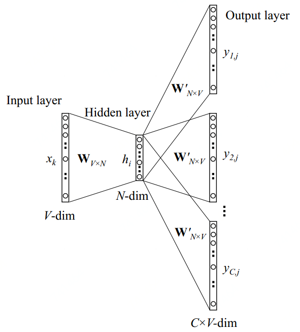

# Skip-Gram

## 模型结构

与CBOW模型正好相反，Skip-Gram模型是根据中心单词（target word）来预测其上上下文信息（context words）。如下图所示，为Skip-Gram模型的结构示意图

我们仍然使用 $$v_{w_I}$$ 来表示输入层上唯一的那个单词的输入向量，因此，我们对于隐藏层的输出值 $$h$$ 的计算公式与CBOW相同，表示如下：

                                                                   $$h = W^T_{k,\cdot}:=v_{w_I}$$ 

上式显示， $$h$$ 向量其实就是输入层到隐藏层权重矩阵 $$W$$ 某一行结合输入单词 $$w_I$$ 的向量拷贝。在输出层，与CBOW模型的输出为单个多项式分布不同的是，Skip-Gram模型在输出层输出了C个多项式分布。每个输出都使用相同的隐藏层到输出层矩阵计算：

                                             $$p(w_{c,j}=w_{O,c}|w_I)=y_{c,j}=\frac{\exp(u_{c,j})}{\sum\limits_{j'=1}^V\exp(u_{j'})}$$ 

 其中， $$w_{c,j}$$ 表示输出层的第 $$c$$ 个panel的第j个单词（何为panel?就是输出层的表示每个上下文单词的神经元的组合，图中一共有 $$C$$ 个context words，所以总共有 $$C$$ 个panel）； $$w_{O,c}$$ 实际上表示的是输出上下文单词（output context words）的第 $$c$$ 个单词； $$w_I$$ 是唯一的输入单词； $$y_{c,j}$$ 为输出层的第 $$c$$ 个panel上的第 $$j$$ 个神经单元的概率输出值； $$u_{c,j}$$ 表示的是输出层第 $$c$$ 个panel的第 $$j$$ 个神经元的输入值；由于输出层的所有panels共享同一权重矩阵 $$W'$$ ，因此：

                                          $$u_{c,j}=u_{j}=v_{w_j}'^T\cdot h,\ \ \ for\ c=1,2,\dots,C$$     

其中， $$v'_{w_j}$$ 为词汇表第 $$j$$ 个单词 $$w_j$$ 的输出向量；同样，它也是取自于隐藏层到输出层权重矩阵 $$W'$$ 的一列。

## 模型训练

Skip-Gram模型参数更新公式的推导过程与One-word context 模型的推导过程大体上一样。这里我们将损失函数变为：

                                                $$E = -\log p(w_{O,1},w_{O,2},\dots,w_{O,C}|w_I)$$ 

                                                     $$=-\log\prod\limits_{c=1}^C\frac{\exp(u_{c,j_{c}^*})}{\sum\limits_{j'=1}^V\exp(u_{j'})}$$ 

                                                     $$= -\sum\limits_{c=1}^Cu_{j_c^*}+C\cdot \log \sum\limits_{j'=1}^V\exp(u_{j'})$$ 

其中， $$j_c^*$$ 为第 $$c$$ 个输出层输出的上下文单词在词汇表中的真实索引。

在得到损失函数 $$E$$ 之后，我们对输出层的每一个panel上的所有激活单元的输入值 $$u_{c,j}$$ 均求其关于 $$E$$ 的偏导数，得：

                                                             $$\frac{\partial E}{\partial u_{c,j}}=y_{c,j}-t_{c,j}:=e_{c,j}$$ 

其中 $$e_{c,j}$$ 为输出层神经元的预测误差。为了简化符号，我们定义一个 $$V$$ 维的向量 $$EI=\{EI_1,EI_2,\dots,EI_V\}$$ 作为所有上下文单词的预测误差之和， $$EI_j$$ 用公式定义如下：

                                                                      $$EI_j=\sum\limits_{c=1}^Ce_{c,j}$$ 

接下来，我们计算隐藏层到输出层权重矩阵 $$W'$$ 关于 $$E$$ 的偏导数为：

                                                        $$\frac{\partial E}{\partial w'_{ij}}=\sum\limits_{c=1}^C\frac{\partial E}{\partial u_{c,j}}\frac{\partial u_{c,j}}{\partial w'_{ij}}=EI_j\cdot h_i$$ 

### 1）隐藏层到输出层权重更新

这样，我们就得到了隐藏层到输出层权重矩阵 $$W'$$ 的参数更新公式为：

                                                        $$w'^{(new)}_{ij}=w'^{(old)}_{ij}-\eta\cdot EI_j\cdot h_i$$ 

或者表示为                                     $$v'^{(new)}_{w_j}=v'^{(old)}_{w_j}-\eta\cdot EI_j\cdot h_i, \ \ \ for\ j=1,2,\dots,V$$ 

上述参数更新公式的直观概念理解与CBOW无二，除了一点就是：输出层的预测误差的计算是基于多个上下文单词context words，而不是单个目标单词 target word；需注意的是对于每一个训练样本，我们都要利用该参数更新公式来更新隐藏层到输出层权重矩阵 $$W'$$ 的每个元素。

### 2）输入层到隐藏层权重更新

同样，对于输入层到隐藏层权重矩阵 $$W$$ 的参数更新公式的推导过程，除了考虑要将预测误差 $$e_j$$ 替换为 $$EI_j$$ 外，其他也与CBOW类似。这里我们直接给出更新公式： 

                                                          $$v^{(new)}_{w_I}=v^{(old)}_{w_I}-\eta\cdot EH^T$$ 

 其中， $$EH$$ 是一个 $$N$$ 维向量，组成该向量的每一个元素可以用如下公式表示： 

                                                              $$EH_i=\sum\limits_{j=1}^VEI_j\cdot w'_{ij}$$ 

## Source







