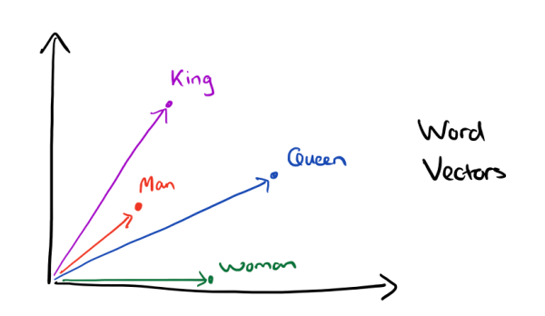
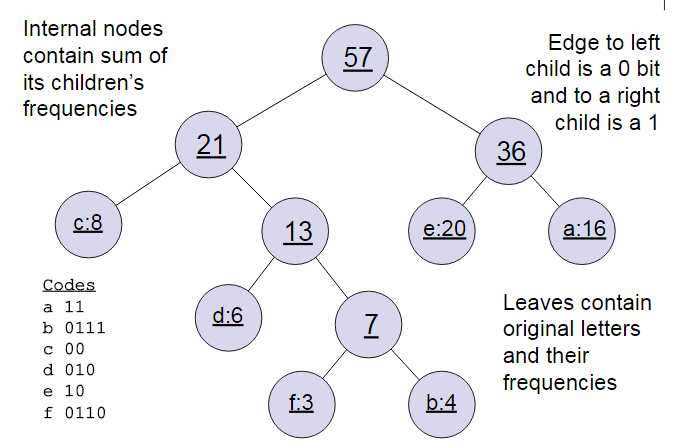

# word2vec

 word2vec为什么不用现成的DNN模型，要继续优化出新方法呢？最主要的问题是DNN模型的这个处理过程非常耗时。我们的词汇表一般在百万级别以上，这意味着我们DNN的输出层需要进行softmax计算各个词的输出概率的的计算量很大。

word2vec转换的向量相比于one-hot编码是低维稠密的。我们称其为Dristributed representation，这可以解决one-hot representation的问题，它的思路是通过训练，将每个词都映射到一个较短的词向量上来。所有的这些词向量就构成了向量空间，进而可以用普通的统计学的方法来研究词与词之间的关系。这个较短的词向量维度我们可以在训练时自己来指定。有了用Dristributed representation表示的较短的词向量，我们就可以较容易的分析词之间的关系了，比如我们将词的维度降维到2维，有一个有趣的研究表明，用下图的词向量表示我们的词时，我们可以发现：

                                                    $$\vec{King}-\vec{Man}+\vec{Woman}=\vec{Queen}$$ 

为了加速训练过程，Google论文里真实实现的word2vec对模型提出了两种改进思路，即Hierarchical Softmax模型和Negative Sampling模型。Hierarchical Softmax是用输出值的霍夫曼编码代替原本的one-hot向量，用霍夫曼树替代Softmax的计算过程。Negative Sampling（简称NEG）使用随机采用替代Softmax计算概率，它是另一种更严谨的抽样模型NCE的简化版本。将这两种算法与前面的两个模型组合，在Google的论文里一共包含了4种Word2Vec的实现：

* Hierarchical Softmax CBOW 模型
* Hierarchical Softmax Skip-Gram 模型
* Negative Sampling CBOW 模型
* Negative Sampling Skip-Gram 模型

## 霍夫曼树

我们已经知道word2vec也使用了CBOW与Skip-Gram来训练模型与得到词向量，但是并没有使用传统的DNN模型。在Hierarchical Softmax中，使用的数据结构是用霍夫曼树来代替隐藏层和输出层的神经元，霍夫曼树的叶子节点起到输出层神经元的作用，叶子节点的个数即为词汇表的小大。 而内部节点则起到隐藏层神经元的作用。霍夫曼树建立过程如下：

输入：权值为 $$(w_1,w_2,\dots,w_n)$$ 的 $$n$$ 个节点

输出：对应的霍夫曼树

* （1）将 $$(w_1,w_2,\dots,w_n)$$ 看作是有 $$n$$ 颗树的森林，每个树仅有一个节点。
* （2）在森林中选择根节点权值最小的两棵树进行合并，得到一个新的树，这两颗树分布作为新树的左右子树。新树的根节点权重为左右子树的根节点权重之和。
* （3）将之前的根节点权值最小的两棵树从森林删除，并把新树加入森林。
* （4）重复步骤（2）和（3）直到森林里只有一颗树为止。

#### 举例如下

我们有\(a,b,c,d,e,f\)共6个节点，节点的权值分布是\(16,4,8,6,20,3\)。

首先是最小的b和f合并，得到的新树根节点权重是7.此时森林里5棵树，根节点权重分别是16,8,6,20,7。此时根节点权重最小的6,7合并，得到新子树，依次类推，最终得到下面的霍夫曼树：

霍夫曼树的好处是，一般得到霍夫曼树后我们会对叶子节点进行霍夫曼编码，由于权重高的叶子节点越靠近根节点，而权重低的叶子节点会远离根节点，这样我们的高权重节点编码值较短，而低权重值编码值较长。这保证的树的带权路径最短，也符合我们的信息论，即我们希望越常用的词拥有更短的编码。如何编码呢？一般对于一个霍夫曼树的节点（根节点除外），可以约定左子树编码为0，右子树编码为1.如上图，则可以得到c的编码是00。

在word2vec中，约定编码方式和上面的例子相反，即约定左子树的编码为 $$1$$ ，右子树的编码为 $$0$$ 。同时约定左子树的权重不小于右子树的权重。

## 基于Hierarchical Softmax的模型

### 基于Hierarchical Softmax的模型概述

我们先回顾下传统的神经网络词向量语言模型，里面一般有三层，输入层（词向量），隐藏层和输出层（softmax层）。里面最大的问题在于从隐藏层到输出的softmax层的计算量很大，因为要计算所有词的softmax概率，再去找概率最大的值。这个模型如下图所示。其中 $$V$$ 是词汇表的大小

word2vec对这个模型做了改进，首先，对于从输入层到隐藏层的映射，没有采取神经网络的线性变换加激活函数的方法，而是采用简单的对所有输入词向量求和并取平均的方法。比如输入的是三个4维词向量：\(1,2,3,4\),\(9,6,11,8\),\(5,10,7,12\),那么我们word2vec映射后的词向量就是\(5,6,7,8\)。由于这里是从多个词向量变成了一个词向量。

第二个改进就是从隐藏层到输出的softmax层这里的计算量改进。为了避免要计算所有词的softmax概率，word2vec采样了霍夫曼树来代替从隐藏层到输出softmax层的映射。理解如何映射就是理解word2vec的关键所在了。

首先我们根据语料库创建一棵霍夫曼树，比如用文本中每个词的词频当做权重，生成霍夫曼树。由于我们把之前所有都要计算的从输出softmax层的概率计算变成了一棵二叉霍夫曼树，那么我们的softmax概率计算只需要沿着树形结构进行就可以了。如下图所示，我们可以沿着霍夫曼树从根节点一直走到我们的叶子节点的词 $$w_2$$ 。

和之前的神经网络语言模型相比，我们的霍夫曼树的所有内部节点就类似之前神经网络隐藏层的神经元，其中，根节点的词向量对应我们的投影后的词向量，而所有叶子节点就类似于之前神经网络softmax输出层的神经元，叶子节点的个数就是词汇表的大小。在霍夫曼树中，隐藏层到输出层的softmax映射不是一下子完成的，而是沿着霍夫曼树一步步完成的，因此这种softmax取名为"Hierarchical Softmax"。

如何“沿着霍夫曼树一步步完成”呢？在word2vec中，我们采用了二元逻辑回归的方法，即规定沿着左子树走，那么就是负类\(霍夫曼树编码1\)，沿着右子树走，那么就是正类\(霍夫曼树编码0\)。判别正类和负类的方法是使用sigmoid函数，即：

                                                        $$P(+)=\sigma(x^T_w\theta)=\frac{1}{1+e^{-x^T_w\theta}}$$ 

其中 $$x_w$$ 是当前内部节点的词向量，而 $$\theta$$ 则是我们需要从训练样本求出的逻辑回归的模型参数。

使用霍夫曼树有什么好处呢？首先，由于是二叉树，之前计算量为 $$V$$ 现在变成了 $$\log_2 V$$ 。第二，由于使用霍夫曼树是高频的词靠近树根，这样高频词需要更少的时间会被找到，这符合我们的贪心优化思想。

容易理解，被划分为左子树而成为负类的概率为 $$P(-)=1-P(+)$$ 。在某一个内部节点，要判断是沿左子树还是右子树走的标准就是看 $$P(-)$$ 和 $$P(+)$$ 谁的概率值大。而控制 $$P(-)$$ 和 $$P(+)$$ 谁的概率值大的因素一个是当前节点的词向量，另一个是当前节点的模型参数 $$\theta$$ 。

对于上图中的 $$w_2$$ ，如果它是一个训练样本的输出，那么我们期望对于里面的隐藏节点 $$n(w_2,1)$$ 的 $$P(-)$$ 概率大， $$n(w_2,2)$$ 的 $$P(-)$$ 概率大， $$n(w_2,3)$$ 的 $$P(+)$$ 概率大。

回到基于Hierarchical Softmax的word2vec本身，我们的目标就是找到合适的所有节点的词向量和所有内部节点 $$\theta$$ ，使训练样本达到最大似然。如何达到最大似然，来看下一节的阐述。

### 基于Hierarchical Softmax的模型梯度计算

接上节模型概述的例子，我们用最大似然法来寻找所有节点的词向量和所有内部节点 $$\theta$$ ，我们期望最大化下面的似然函数（我们期望对于里面的隐藏节点 $$n(w_2,1)$$ 的 $$P(-)$$ 概率大， $$n(w_2,2)$$ 的 $$P(-)$$ 概率大， $$n(w_2,3)$$ 的 $$P(+)$$ 概率大）：

                             $$\prod_{i=1}^3P(n(w_i),i)=(1-\frac{1}{1+e^{-x^T_w\theta_1}})(1-\frac{1}{1+e^{-x^T_w\theta_2}})\frac{1}{1+e^{-x^T_w\theta_3}}$$ 

对于所有的训练样本，我们期望最大化所有样本的似然函数乘积。

为了便于我们后面一般化的描述，我们定义输入的词为 $$w$$ ，其从输入层词向量求和平均后的霍夫曼树根节点词向量为 $$x_w$$ ，从根节点到 $$w$$ 所在的叶子节点，包含的节点总数为 $$l_w$$ ， $$w$$ 在霍夫曼树中从根节点开始，经过的第 $$i$$ 个节点（不包括根节点）表示为 $$p_i^w$$ ，对应的霍夫曼编码为 $$d_i^w\in\{0,1\},i=2,3,\dots,l_w$$ 。而该节点对应的模型参数表示为 $$\theta^w_i$$ ，其中 $$i=1,2,\dots,l_{w}-1$$ ，没有 $$i=l_w$$ 是因为模型参数仅仅针对霍夫曼树的内部节点。

定义 $$w$$ 经过的霍夫曼树某一节点 $$j$$ 的逻辑回归概率为 $$P(d_j^w|x_w,\theta_{j-1}^w)$$ ，其表达式为

                                         $$P(d_j^w|x_w,\theta_{j-1}^w)=\begin{cases}\sigma(x_w^T\theta_{j-1}^W)\ \ \ \ \ \ \ \ \ \ \ d_j^w=0\\ 1-\sigma(x_w^T\theta_{j-1}^W)\ \ \ \ d_j^w=1\end{cases}$$ 

那么对于某一个目标输出词 $$w$$ ，其最大似然为：

                           $$\prod_{j=2}^{l_w}P(d_j^w|x_w,\theta_{j-1}^w)=\prod_{j=2}^{l_w}[\sigma(x_w^T\theta_{j-1}^w)]^{1-d_j^w}[1-\sigma(x_w^T\theta_{j-1}^w)]^{d_j^w}$$ 

我们可以看到，每一个词 $$w$$ 都对应着自己的一套逻辑回归参数 $$\theta^w$$ 。

在word2vec中，由于使用的是随机梯度上升法，所以并没有把所有样本的似然乘起来得到真正的训练集最大似然，仅仅每次只用一个样本更新梯度，这样做的目的是减少梯度计算量。这样我们可以得到 $$w$$ 的对数似然函数 $$L$$ 如下：

        $$L=\log\prod\limits_{j=2}^{l_w}P(d_j^w|x_w,\theta_{j-1}^w)=\sum\limits_{j=2}^{l_w}((1-d_j^w)\log[\sigma(x_w^T\theta_{j-1}^w)]+d_j^w\log[1-\sigma(x_w^T\theta_{j-1}^w)])$$ 

要得到模型中 $$w$$ 词向量和内部节点的模型参数 $$\theta$$ ，我们使用梯度上升法即可。首先我们求模型参数 $$\theta_{j-1}^w$$ 的梯度：

                  $$\frac{\partial L}{\partial \theta_{j-1}^w} = (1-d_j^w)\frac{(\sigma(x_w^T\theta_{j-1}^w)(1-\sigma(x_w^T\theta_{j-1}^w)))}{\sigma(x_w^T\theta_{j-1}^w)}x_w- d_j^w\frac{(\sigma(x_w^T\theta_{j-1}^w)(1-\sigma(x_w^T\theta_{j-1}^w)))}{1-\sigma(x_w^T\theta_{j-1}^w)}x_w$$ 

                             $$= (1-d_j^w)(1-\sigma(x_w^T\theta_{j-1}^w))x_w-d_j^w\sigma(x_w^T\theta_{j-1}^w)x_w $$ 

                             $$= (1-d_j^w-\sigma(x_w^T\theta_{j-1}^w))x_w$$ 

在这里，用到了逻辑回归里的一个公式： $$\sigma'(x)=\sigma(x)(1-\sigma(x))$$ 

同样的方法，可以求出 $$x_w$$ 的梯度表达式如下：

                                                 $$\frac{\partial L}{\partial x_w}=(1-d_j^w-\sigma(x^T_w\theta^w_{j-1}))\theta_{j-1}^w$$ 

我们的最终目的是求得词典中每个词的词向量，而这里的 $$x_w$$ 表示的是 $$w$$ 的上下文Context各词词向量的均值，那么，如何利用 $$\frac{\partial L}{\partial x_w}$$ 来对 $$w$$ 的上下文context中每个词向量 $$\tilde{w}$$ 进行更新呢？word2vec的做法很简答，直接取

                                               $$\frac{\partial L}{\partial x_w}=\sum\limits_{j=2}^{l_w}(1-d_j^w-\sigma(x^T_w\theta^w_{j-1}))\theta_{j-1}^w$$ 

即把 $$\sum\limits_{j=2}^{l_w}\frac{\partial L}{\partial x_w}$$ 贡献到Context中每一个词的词向量中。这个很好理解，既然 $$x_w$$ 本身就是Context中各个词向量的累加平均，求完梯度后当然也应该贡献到每个分量上去。

### 基于Hierarchical Softmax的CBOW模型

由于word2vec有两种模型：CBOW和Skip-Gram，我们先看看基于CBOW模型时， Hierarchical Softmax如何使用。首先我们要定义词向量的维度大小 $$M$$ ，以及CBOW的上下文大小 $$2c$$ ，这样我们对于训练样本中的每一个词，其前面的 $$c$$ 个词和后面的 $$c$$ 个词作为CBOW模型的输入，该词本身作为样本的输出，期望softmax概率最大。

在做CBOW模型前，我们需要先将词汇表建立成一棵霍夫曼树。

对于从输入层到隐藏层，这一步比较简单，就是对 $$w$$ 周围的 $$2c$$ 个词向量求和取平均即可，即

                                                                      $$x_w=\frac{1}{2c}\sum\limits_{i=1}^{2c}x_i$$ 

第二步，通过梯度上升法来更新我们的 $$\theta_{j-1}^w$$ 和 $$x_w$$ ，注意，这里的 $$x_w$$ 是由 $$2c$$ 个词向量相加平均而成，我们做梯度更新完毕后会用梯度项直接更新原始的各个 $$x_i(i=1,2,\dots,2c)$$ ，即

                                                $$\theta_{j-1}^w=\theta_{j-1}^w+\eta(1-d_j^w-\sigma(x_w^T\theta_{j-1}^w))x_w$$ 

                              $$x_w=x_w+\eta\sum\limits_{j=2}^{l_w}(1-d_j^w-\sigma(x^T_w\theta_{j-1}^w))\theta_{j-1}^w, \ \ \ \ \ \ i=1,2,\dots,2c$$ 

其中 $$\eta$$ 为梯度上升法的步长。

#### 算法流程

输入：基于CBOW的语料训练样本，词向量的维度大小 $$M$$ ，CBOW的上下文大小 $$2c$$ ，步长 $$\eta$$ 

输出：霍夫曼树的内部结点模型参数 $$\theta$$ ，所有的词向量 $$w$$ 

* （1）基于语料训练样本建立霍夫曼树
* （2）随机初始化所有的参数模型 $$\theta$$ ，所有的词向量 $$w$$ 
* （3）进行梯度上升迭代过程，对于训练集中的每一个样本（Context\(w\)，w）做如下处理：
*           （a） $$e = 0$$ ，计算 $$x_w=\frac{1}{2c}\sum\limits_{i=1}^{2c}x_i$$ 
*           （b）for $$j=2\ $$ to $$l_w$$ ，计算
*                                   $$f=\sigma(x^T_w\theta_{j-1}^w)$$ 
*                                   $$g = (1-d_j^w-f)\eta$$ 
*                                   $$e = e+g\theta_{j-1}^w$$ 
*                                   $$\theta_{j-1}^w=\theta_{j-1}^w+gx_w$$ 
*           （c）对于Context中的每一个词向量 $$x_i$$ （共 $$2c$$ 个）进行更新：
*                                    $$x_i=x_i+e$$ 
*           （d）如果梯度收敛，则结束梯度迭代，否则回到步骤（3）继续迭代

### 基于Hierarchical Softmax的Skip-Gram模型

现在我们先看看基于Skip-Gram模型时， Hierarchical Softmax如何使用。此时输入的只有一个词 $$w$$ ，输出的为 $$2c$$ 个词向量Context。

我们对于训练样本的每一个词，该词本身作为样本的输入，其前面的 $$c$$ 个词和后面的 $$c$$ 个词作为了Skip-Gram模型的输出，期望这些词的softmax概率比其他的词大。

第一步，在做Skip-Gram模型前，我们需要先将词汇表建立成一棵霍夫曼树。

对于从输入层到隐藏层，这一步比CBOW简单，只有一个词，即 $$x_w$$ 就是词 $$w$$ 对应的输入词向量。

第二步，通过梯度上升法来更新我们的 $$\theta_{j-1}^w$$ 和 $$x_w$$ ，注意这里的 $$x_w$$ 周围有 $$2c$$ 个词向量，此时如果我们期望 $$P(x_i|x_w),i=1,2,\dots,2c$$ 最大。此时我们注意到由于上下文是相互的，在期望 $$P(x_i|x_w),i=1,2,\dots,2c$$ 最大化的同事，反过来我们也期望 $$P(x_w|x_i),i=1,2,\dots,2c$$ 最大。那么是使用 $$P(x_i|x_w)$$ 好还是 $$P(x_w|x_i)$$ 好呢，word2vec使用了后者，这样做的好处就是在一个迭代窗口内，我们不是只更新 $$x_w$$ 一个词，而是 $$x_i,i=1,2,\dots,2c$$ 共 $$2c$$ 个词。这样整体的迭代会更加均衡。因为这个原因，Skip-Gram模型并没有和CBOW模型一样对输入进行迭代更新，而是对 $$2c$$ 个输出进行迭代更新。

#### 算法流程

输入：基于Skip-Gram的语料训练样本，词向量的维度大小 $$M$$ ，Skip-Gram的上下文大小 $$2c$$ ，步长 $$\eta$$ 

输出：霍夫曼树的内部结点模型参数 $$\theta$$ ，所有的词向量 $$w$$ 

* （1）基于语料训练样本建立霍夫曼树
* （2）随机初始化所有的参数模型 $$\theta$$ ，所有的词向量 $$w$$ 
* （3）进行梯度上升迭代过程，对于训练集中的每一个样本（w，Context\(w\)）做如下处理：
*           （a） for $$i = 1$$  to $$2c$$ ：
*                           （i） $$e = 0$$ 
*                           （ii）for $$j = 2$$  to $$l_w$$ ，计算：
*                                                $$f = \sigma(x_i^T\theta_{j-1}^w)$$ 
*                                                $$g= (1-d_j^w-f)\eta$$ 
*                                                $$e = e+g\theta_{j-1}^w$$ 
*                                                $$\theta_{j-1}^w=\theta_{j-1}^w+gx_i$$ 
*                           （iii） $$x_i=x_i+e$$ 
*            （b）如果梯度收敛，则结束梯度迭代，算法结束，否则回到步骤（a）继续迭代

### 基于Hierarchical Softmax模型缺点

（1）如上图，训练完 $$w_2$$ 后， $$n(w_2,1),n(w_2,2),n(w_2,3)$$ 结点中的参数进行了改变，保证了上下文\(Context\)和目标词\(target word\)对的最大似然，但是再训练 $$w_1$$ 时，路径上的结点参数又进行了改变，此时不能保证还能满足训练 $$w_2$$ 时的最大似然，即，不能保证全局最优解，即每个结点的参数保证每个叶结点都可满足最大似然的。

（2）如果我们的训练样本里的中心词 $$w$$ 是一个很生僻的词，那么就是在霍夫曼是中辛苦向下走了很久。

## 基于Negative Sampling的模型

### Hierarchical Softmax的缺点与改进

在讲基于Negative Sampling的word2vec模型前，我们先看看Hierarchical Softmax的的缺点。的确，使用霍夫曼树来代替传统的神经网络，可以提高模型训练的效率。但是如果我们的训练样本里的中心词 $$w$$ 是一个很生僻的词，那么就是在霍夫曼是中辛苦向下走了很久。能不能不用搞这么复杂的一颗霍夫曼树，将模型变的更加简单呢？

Negative Sampling就是这么一种求解word2vec模型的方法，它摒弃了霍夫曼树，采用了Negative Sampling（负采样）的方法来求解，下面我们就来看看Negative Sampling的求解思路。

### 基于Negative Sampling的模型概述

既然名字叫Negative Sampling（负采样），那么肯定使用了采样的方法。

比如我们有一个训练样本，中心词是 $$w$$ ，它周围上下文共有 $$2c$$ 个词，记为Context\(w\)。由于这个中心词 $$w$$ 的确和Context\(w\)相关存在，因此它是一个真实的正例。通过Negative Sampling采样，我们可以得到 $$n$$ 个和 $$w$$ 不同的中心词 $$w_i,i=1,2,\dots,n$$ ，这样Context\(w\)和

### 基于Negative Sampling的模型梯度计算

### Negative Sampling负采样方法

### 基于Negative Sampling的CBOW模型

### 基于Negative Sampling的Skip-Gram模型

## Hierarchical Softmax和Negative Sampling的一些细节

## Source









